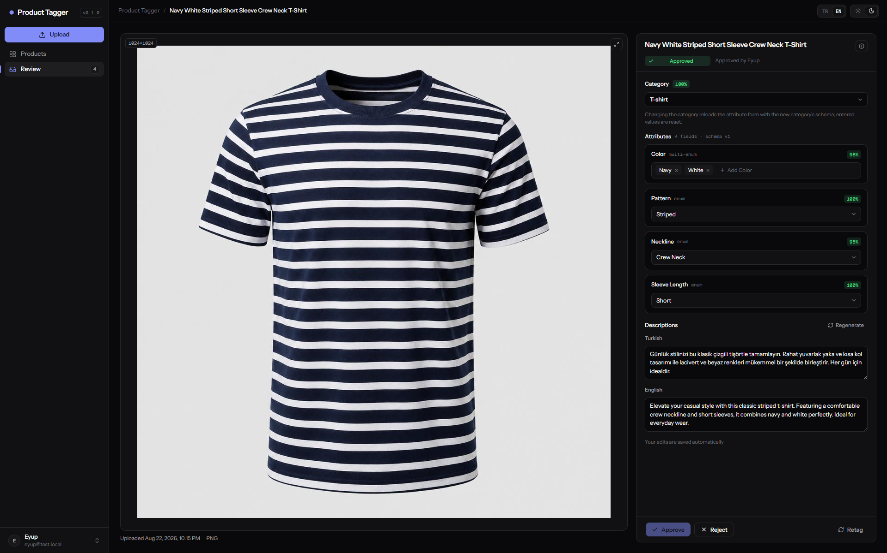
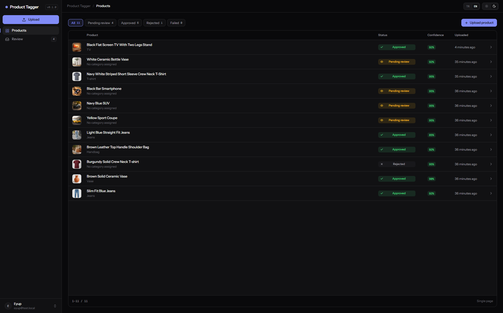

# Product Tagger

Self-hosted AI product cataloging. Upload product photos; a vision model proposes the category, attributes and confidence scores; a human reviews and approves; bilingual (TR/EN) titles and descriptions are generated from the approved data. Nothing is published without human approval.





## How it works

- **Iterative category descent** — the model walks the category tree level by level, choosing among 5–10 options per step, so prompts stay small no matter how large the tree grows. Every level has an `other` escape hatch that routes the product to manual review.
- **Schema-driven attributes** — each leaf category has a versioned JSONB attribute schema; the review form is rendered from it, so adding a category or attribute is configuration, not code.
- **Confidence scores per field** — high-confidence fields come pre-filled, low-confidence ones are highlighted for the reviewer.
- **Descriptions from approved data** — text is generated from the approved attributes rather than the raw image, so it never contradicts the structured data.
- **Live progress** — status changes stream to the browser over SSE while the pipeline runs.

## Stack

| Layer | Technology |
|---|---|
| Backend | Java 21, Spring Boot 4, Spring AI, Spring Data JPA, Flyway |
| AI | Qwen3.5 via Hugging Face Inference Providers (hosted) or Ollama (local) |
| Data | PostgreSQL 16 + pgvector, JSONB attribute storage |
| Messaging | RabbitMQ (retry with backoff, dead-letter queue, outbox pattern) |
| Storage | MinIO (S3-compatible, AWS SDK) |
| Frontend | Angular (standalone + signals), Transloco i18n (TR/EN), SSE client |
| Serving | nginx (SPA + `/api` reverse proxy), Docker Compose |

## Quick start

Requires Docker. Clone, then:

```bash
cp .env.example .env
```

Edit `.env` and set at least:

- `JWT_SECRET` — any long random string (48+ bytes)
- `HF_TOKEN` — a Hugging Face token with inference permission (for the default hosted AI profile)

Then:

```bash
docker compose up -d --build
```

Open **http://localhost**, register a user and upload a product photo. The first build takes a few minutes; subsequent builds are cached.

### Local AI instead of Hugging Face

Run the model on your own machine with Ollama:

```bash
docker compose --profile local-ai up -d --build
```

with `SPRING_PROFILES_ACTIVE=local` in `.env`, and pull the model once:

```bash
docker exec pt-ollama ollama pull qwen3.5:4b
```

## Development

Infrastructure only (Postgres, RabbitMQ, MinIO):

```bash
docker compose -f docker-compose.dev.yml up -d
```

- **Backend:** run the Spring Boot app from your IDE (profile `hosted` or `local`); it connects to the containers on localhost.
- **Frontend:** `npm start` in `frontend/` — the dev server proxies `/api` to `localhost:8080`.